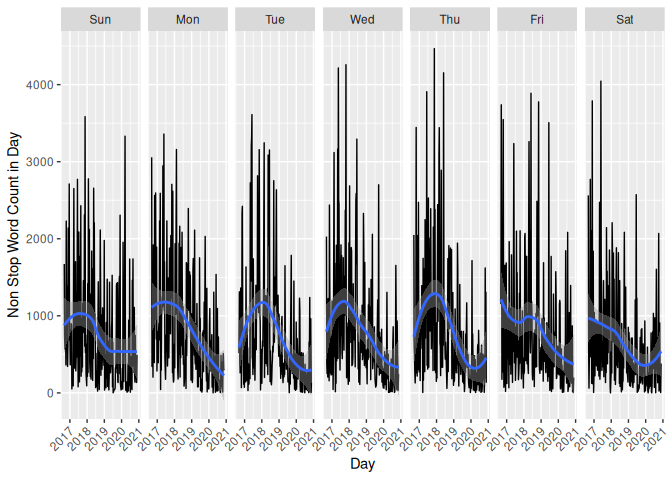
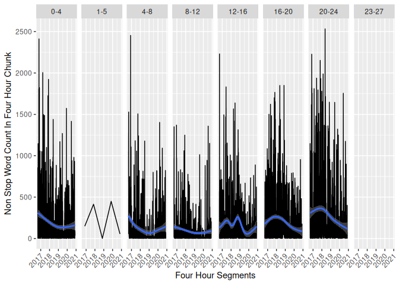
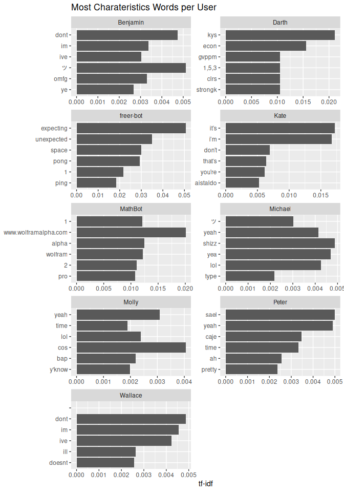

# Text Analysis of a Discord Chat Group

## Thanks to the Editor

A large thank you to [William Zhu](https://github.com/ZhuWilliam) for
editing this poorly written document into something nice.

## Data Acquisition

To get the data needed for analysis, one can go directly to the source
via [Get Channel
Message](https://discordapp.com/developers/docs/resources/channel#get-channel-messages)
or use an existing tool to do it for you. The most prominent utility is
[DiscordChatExporter](https://github.com/Tyrrrz/DiscordChatExporter).
Although the JSON schema it exports is slightly different to the Discord
API spec, not counting added data by the tool, the data is easy to
aquire and use.

Using DiscordChatExporter, an auth token, and a channel id one can
export all chat history in JSON format and then import it into R. Once
imported, we can toss the extra data added about the channel export by
directly acessing the nested list of messages.

## Data Import

``` r
library(jsonlite)

# regular read of direct JSON file
#chat_json <- read_json('./discord_chat_anonymized.json')$messages

# in memory gunzip, highly recomended to compress large JSON logs
# read_json(...) == fromJson(..., simplifyVector = FALSE)
# but handles more than just a string filepath such as connections (R file objects)
log_gzipped <- gzfile('./discord_chat_anonymized.json.gz', open = 'rb') # fromJSON needs binary
chat_json <- fromJSON(log_gzipped, simplifyVector = FALSE)$messages
close(log_gzipped)

# check schema of first message
str(chat_json[[1]])
```

    ## List of 11
    ##  $ id                : chr "221469972705050624"
    ##  $ type              : chr "Default"
    ##  $ timestamp         : chr "2016-09-03T03:22:36.206+00:00"
    ##  $ timestampEdited   : NULL
    ##  $ callEndedTimestamp: NULL
    ##  $ isPinned          : logi FALSE
    ##  $ content           : chr "tovarish"
    ##  $ author            :List of 5
    ##   ..$ id           : chr "162781767122550784"
    ##   ..$ name         : chr "Benjamin"
    ##   ..$ discriminator: chr "8767"
    ##   ..$ isBot        : logi FALSE
    ##   ..$ avatarUrl    : chr "https://cdn.discordapp.com/avatars/162781767122550784/292f7eff05847dbae524ca6bf22b19bf.png"
    ##  $ attachments       : list()
    ##  $ embeds            : list()
    ##  $ reactions         : list()

This imports the json messages as an R list. However, the list is not
uniform in fields across message entries as some messages have
reactions, a feature introduced later in Discord’s development that
messages before the update do not have. This inconsistency prevents
running the list into `data.table::rbindlist`, so I used an alternative
method. I extracted the relevant fields with
[purrr](https://cran.r-project.org/web/packages/purrr/vignettes/other-langs.html)
and then stitched it back together into a
[data.table](https://cran.r-project.org/web/packages/data.table/vignettcs/datatable-intro.html).
I then checked the result with
[dplyr’s](https://cran.r-project.org/web/packages/dplyr/vignettes/dplyr.html)
glimpse. Note that time was converted to PST/PDT. All times shown will
be with repsect to PST/PDT.

``` r
library(purrr)
library(data.table) # masks some of lubridate's functions
library(lubridate)
library(dplyr)
library(dtplyr)

chat <- data.table(
    timestamp = map_chr(chat_json, 'timestamp') %>% ymd_hms(),
    # Discord author JSON spec calls the field `username` not `name`
    username = map_chr(chat_json, c('author', 'name')) %>% as.factor(),
    message = map_chr(chat_json, 'content')
)
rm(chat_json)

chat[, timestamp := with_tz(timestamp, tzone = 'US/Pacific')] # convert to PST/PDT (same time)

glimpse(chat)
```

    ## Rows: 686,310
    ## Columns: 3
    ## $ timestamp <dttm> 2016-09-02 20:22:36, 2016-09-02 20:22:38, 2016-09-02 20:28…
    ## $ username  <fct> Benjamin, Benjamin, Wallace, Wallace, Benjamin, Benjamin, B…
    ## $ message   <chr> "tovarish", "really", "yeah", "so lets use this from now on…

``` r
chat[1, timestamp]
```

    ## [1] "2016-09-02 20:22:36 PDT"

## Data Tidying

### User and Message Tidying

Some users did not post much so we filter them out. On top of filtering
users, we remove URLs and long digits with regex.

``` r
library(magrittr) # for %<>% (originator of %>%)
library(stringr)

chat %<>%
    .[!.[, .N, username][N < 100], on = 'username'] %>% # anti join
    .[, username := droplevels(username)] %>%
    .[, message := str_replace(message, '(https?\\S+)|(\\d{4,})', '')]
```

### Word Tokenization

To convert the `chat` data.table into a more convienient [tidy
format](http://tidytextmining.com/tidytext.html), with one token per
row, we can use
[tidytext](https://cran.r-project.org/web/packages/tidytext/vignettes/tidytext.html).
Common words can cause problems, but they can be removed with the help
of tidytext’s `stop_words`.

``` r
library(tidytext)

words <- chat %>%
    unnest_tokens(word, message) %>%
    .[!data.table(stop_words), on = 'word'] # anti join

glimpse(words)
```

    ## Rows: 1,158,391
    ## Columns: 3
    ## $ timestamp <dttm> 2016-09-02 20:22:36, 2016-09-02 20:28:12, 2016-09-02 20:35…
    ## $ username  <fct> Benjamin, Wallace, Benjamin, Benjamin, Benjamin, Benjamin, …
    ## $ word      <chr> "tovarish", "yeah", "lol", "skype", "wont", "reacive", "ins…

### Bigram Tokenization

Next, we prepare the tokenization of bigrams in much the same fashion as
for words by using `unnest_tokens`, followed by
[tidyr’s](https://cran.r-project.org/web/packages/tidyr/vignettes/tidy-data.html)
separate, and finally removing common words.

``` r
library(tidyr)

bigrams <- chat %>%
    unnest_tokens(bigram, message, token = 'ngrams', n = 2) %>%
    data.table() %>% # unnest tokens on words returns the same structure but on bigrams it returns a tibble
    separate(bigram, c('word1', 'word2'), sep = ' ') %>%
    .[!word1 %in% stop_words$word & !word2 %in% stop_words$word,]

glimpse(bigrams)
```

    ## Rows: 574,336
    ## Columns: 4
    ## $ timestamp <dttm> 2016-09-02 20:22:36, 2016-09-02 20:22:38, 2016-09-02 20:28…
    ## $ username  <fct> Benjamin, Benjamin, Wallace, Benjamin, Benjamin, Benjamin, …
    ## $ word1     <chr> NA, NA, NA, NA, "wont", "reacive", "instant", NA, NA, NA, N…
    ## $ word2     <chr> NA, NA, NA, NA, "reacive", "instant", "messages", NA, NA, N…

## Data Analysis

### Word Counts

What are the top words? Here we check the top three words per user.

``` r
word_counts <- words %>%
    .[, .N, .(username, word)] %>%
    setorder(-N)

word_counts[, head(.SD, 3), username]
```

    ##      username       word     N
    ##  1:  Benjamin        lol 10669
    ##  2:  Benjamin       yeah  5038
    ##  3:  Benjamin         im  4222
    ##  4:   Michael        lol  5032
    ##  5:   Michael       yeah  2295
    ##  6:   Michael        yea   803
    ##  7:   Wallace      boris  4800
    ##  8:   Wallace         im  4795
    ##  9:   Wallace        lol  3556
    ## 10:     Molly        lol  1465
    ## 11:     Molly      boris  1254
    ## 12:     Molly       yeah   889
    ## 13:   MathBot          1   213
    ## 14:   MathBot          2   196
    ## 15:   MathBot          3    63
    ## 16: freer-bot          1   147
    ## 17: freer-bot unexpected    69
    ## 18: freer-bot  expecting    69
    ## 19:     Peter       yeah   114
    ## 20:     Peter      boris    52
    ## 21:     Peter       caje    50
    ## 22:      Kate       it’s    70
    ## 23:      Kate        i’m    68
    ## 24:      Kate   aistaldo    43
    ## 25:     Darth      books     8
    ## 26:     Darth         cs     5
    ## 27:     Darth       math     4
    ##      username       word     N

How about visually?

``` r
library(ggplot2)

#word_counts %>%
    #.[head(setorder(.[, .(total = sum(N)), word], -total), 20), on = 'word'] %>%
    #ggplot(aes(reorder(word, total), N, fill = username)) +
    #geom_col() +
    #coord_flip()

word_counts %>%
    .[.[, .(total = sum(N)), word] %>%
        setorder(-total) %>%
        head(20)
    , on = 'word'] %>%
    ggplot(aes(reorder(word, total), N, fill = username)) +
    geom_col() +
    coord_flip() +
    labs(x = 'Word', y = 'Word Count', fill = 'Username')
```

<!-- -->

<details>
<summary>
WIP: Time Bases Analysis
</summary>

``` r
#words_by_day <- words %>%
    #.[, .(timestamp = floor_date(timestamp, 'day'))] %>%
    #.[, .(words_in_day = .N), timestamp] %>%
    #.[, .(timestamp, words_in_day, day_of_week = wday(timestamp, label = TRUE))]

words_by_day <- words %>%
    #.[, `:=`(username = NULL, word = NULL)] %T>% glimpse() %>%
    .[, .(timestamp = floor_date(timestamp, 'day'))] %>%
    .[, .(words_in_day = .N), timestamp] %>%
    .[, day_of_week := wday(timestamp, label = TRUE)]

plot <- ggplot(words_by_day, aes(timestamp, words_in_day)) +
    geom_line() +
    geom_smooth() +
    labs(x = 'Day', y = 'Non Stop Word Count in Day')

plot
```

<!-- -->

``` r
theme_x_axis_text_45 <- theme(axis.text.x = element_text(angle = 45, vjust = 1.1,  hjust = 1.1))

plot +
    facet_grid(.~day_of_week) +
    theme_x_axis_text_45
```

<!-- -->

``` r
    #theme(axis.text.x = element_text(angle = 90, vjust = 0.5,  hjust = 1))
```

``` r
words_by_day_per_user <- copy(words) %>%
    .[, `:=`(word = NULL, timestamp = floor_date(timestamp, 'day'))] %>%
    .[, .(words_in_day_per_user = .N), .(timestamp, username)] %>%
    .[, day_of_week := wday(timestamp, label = TRUE)]

plot <- ggplot(words_by_day_per_user, aes(timestamp, words_in_day_per_user)) +
    geom_line() +
    geom_smooth() +
    labs(x = 'Day', y = 'Non Stop Word Count In Day')

plot +
    facet_grid(username~.)
```

<!-- -->

``` r
plot +
    facet_grid(username ~ day_of_week) +
    theme_x_axis_text_45
```

<!-- -->

``` r
    #theme(axis.text.x = element_text(angle = 45, vjust = 1.1,  hjust = 1.1))
```

``` r
#TODO: check timezone and consider making the 4 in 4 hours per chunk a variable
chat[1, timestamp]
```

    ## [1] "2016-09-02 20:22:36 PDT"

``` r
words_by_hour <- words %>%
    #.[, `:=`(username = NULL, word = NULL)] %T>% glimpse() %>%
    .[, .(timestamp = floor_date(timestamp, '4 hours'))] %>%
    .[, .(words_in_hour = .N), timestamp] %>%
    .[, hours_chunk := hour(timestamp)]

glimpse(words_by_hour)
```

    ## Rows: 6,362
    ## Columns: 3
    ## $ timestamp     <dttm> 2016-09-02 20:00:00, 2016-09-03 00:00:00, 2016-09-03 0…
    ## $ words_in_hour <int> 1151, 859, 1053, 478, 10, 45, 118, 521, 681, 18, 2, 5, …
    ## $ hours_chunk   <int> 20, 0, 4, 8, 12, 16, 20, 0, 4, 8, 12, 16, 20, 0, 4, 8, …

``` r
words_by_hour[, head(.SD, 3), hours_chunk]
```

    ##     hours_chunk           timestamp words_in_hour
    ##  1:          20 2016-09-02 20:00:00          1151
    ##  2:          20 2016-09-03 20:00:00           118
    ##  3:          20 2016-09-04 20:00:00           446
    ##  4:           0 2016-09-03 00:00:00           859
    ##  5:           0 2016-09-04 00:00:00           521
    ##  6:           0 2016-09-05 00:00:00           103
    ##  7:           4 2016-09-03 04:00:00          1053
    ##  8:           4 2016-09-04 04:00:00           681
    ##  9:           4 2016-09-05 04:00:00          1272
    ## 10:           8 2016-09-03 08:00:00           478
    ## 11:           8 2016-09-04 08:00:00            18
    ## 12:           8 2016-09-05 08:00:00           968
    ## 13:          12 2016-09-03 12:00:00            10
    ## 14:          12 2016-09-04 12:00:00             2
    ## 15:          12 2016-09-05 12:00:00           567
    ## 16:          16 2016-09-03 16:00:00            45
    ## 17:          16 2016-09-04 16:00:00             5
    ## 18:          16 2016-09-05 16:00:00           143
    ## 19:           1 2016-11-06 01:00:00           148
    ## 20:           1 2017-11-05 01:00:00           414
    ## 21:           1 2018-11-04 01:00:00             1
    ## 22:          23 2019-03-09 23:00:00            31
    ##     hours_chunk           timestamp words_in_hour

``` r
words_by_hour[, .(.N), hours_chunk]
```

    ##    hours_chunk    N
    ## 1:          20 1299
    ## 2:           0 1121
    ## 3:           4  738
    ## 4:           8  822
    ## 5:          12 1120
    ## 6:          16 1256
    ## 7:           1    5
    ## 8:          23    1

``` r
copy(words)[, time := floor_date(timestamp, '4 hours')] %>%
    .[, hours_chunk := hour(time)] %>%
    .[hours_chunk == 1] %T>%
    .[, timestamp]
```

    ##                 timestamp username    word                time hours_chunk
    ##    1: 2016-11-06 01:36:45 Benjamin samsung 2016-11-06 01:00:00           1
    ##    2: 2016-11-06 01:36:45 Benjamin      85 2016-11-06 01:00:00           1
    ##    3: 2016-11-06 01:36:45 Benjamin percent 2016-11-06 01:00:00           1
    ##    4: 2016-11-06 01:36:45 Benjamin    note 2016-11-06 01:00:00           1
    ##    5: 2016-11-06 01:36:45 Benjamin      7s 2016-11-06 01:00:00           1
    ##   ---                                                                     
    ## 1063: 2020-11-01 02:36:46 Benjamin      ツ 2020-11-01 01:00:00           1
    ## 1064: 2020-11-01 02:36:57 Benjamin    live 2020-11-01 01:00:00           1
    ## 1065: 2020-11-01 02:36:57 Benjamin villain 2020-11-01 01:00:00           1
    ## 1066: 2020-11-01 02:37:09 Benjamin   anger 2020-11-01 01:00:00           1
    ## 1067: 2020-11-01 02:37:09 Benjamin quelled 2020-11-01 01:00:00           1

``` r
unique(tz(chat[, timestamp]))
```

    ## [1] "US/Pacific"

``` r
hour_chunk_labeller <- function(hours_in_chunk)
{
    function(facet_var)
    {
        paste(facet_var, as.numeric(facet_var) + hours_in_chunk, sep = '-')
    }
}

ggplot(words_by_hour, aes(timestamp, words_in_hour)) +
    geom_line() +
    geom_smooth() +
    facet_grid(.~hours_chunk, labeller = as_labeller(hour_chunk_labeller(4))) +
    labs(x = 'Four Hour Segments', y = 'Non Stop Word Count In Four Hour Chunk') +
    theme_x_axis_text_45
```

<!-- -->

``` r
words_by_hour_per_user <- copy(words) %>%
    .[, `:=`(word = NULL, timestamp = floor_date(timestamp, '4 hours'))] %>%
    .[, .(words_in_hour_per_user = .N), .(timestamp, username)] %>%
    .[, hours_chunk := hour(timestamp)]

glimpse(words_by_hour_per_user)
```

    ## Rows: 14,351
    ## Columns: 4
    ## $ timestamp              <dttm> 2016-09-02 20:00:00, 2016-09-02 20:00:00, 201…
    ## $ username               <fct> Benjamin, Wallace, Benjamin, Wallace, Wallace,…
    ## $ words_in_hour_per_user <int> 935, 216, 511, 348, 555, 498, 44, 340, 94, 10,…
    ## $ hours_chunk            <int> 20, 20, 0, 0, 4, 4, 8, 8, 8, 12, 16, 16, 20, 2…

``` r
ggplot(words_by_hour_per_user, aes(timestamp, words_in_hour_per_user)) +
    geom_line() +
    geom_smooth() +
    facet_grid(username ~ hours_chunk,
               labeller = labeller(hours_chunk = as_labeller(hour_chunk_labeller(4)))) +
    labs(x = 'Four Hour Segments', y = 'Non Stop Word Count In Four Hour Chunk') +
    theme_x_axis_text_45
```

<!-- -->
</details>

### Bigram Counts

``` r
bigram_counts_per_user <- bigrams %>%
    na.omit() %>%
    .[, .N, .(username, word1, word2)] %>%
    setorder(-N)

bigram_counts <- bigram_counts_per_user %>%
    .[, .(N = sum(N)), .(word1, word2)]

head(bigram_counts, 5)
```

    ##    word1 word2   N
    ## 1:  holy  shit 664
    ## 2: makes sense 403
    ## 3:    im gonna 271
    ## 4:  copy paste 287
    ## 5:     1     2 443

``` r
bigram_counts_per_user[, head(.SD, 3), username]
```

    ##      username      word1     word2   N
    ##  1:   Wallace       holy      shit 647
    ##  2:   Wallace         im     gonna 243
    ##  3:   Wallace          1         2 178
    ##  4:  Benjamin      makes     sense 283
    ##  5:  Benjamin       copy     paste 196
    ##  6:  Benjamin          2         3 175
    ##  7:   Michael       yeah       idk  65
    ##  8:   Michael     visual    studio  52
    ##  9:   Michael      gonna      head  51
    ## 10:     Molly    morning     boris  56
    ## 11:     Molly        bap       bap  48
    ## 12:     Molly          0         0  35
    ## 13:   MathBot    wolfram     alpha  43
    ## 14:   MathBot  rendering    failed  35
    ## 15:   MathBot     failed     check  35
    ## 16: freer-bot unexpected expecting  41
    ## 17: freer-bot      white     space  38
    ## 18: freer-bot  expecting      ping  24
    ## 19:     Peter         11        10   6
    ## 20:     Peter       heck      yeah   4
    ## 21:     Peter      feels       bad   4
    ## 22:      Kate     garlic     toast   4
    ## 23:      Kate     garlic     bread   4
    ## 24:      Kate      green     giant   4
    ## 25:     Darth       math     major   2
    ## 26:     Darth       drop    school   2
    ## 27:     Darth         ez        cs   1
    ##      username      word1     word2   N

### Characteristic Words

To answer the question of what words are characteristic of document
among a corpus we can use tf-idf. In our case, we consider the corpus to
be all of the text in the logs and each user’s text as a document. Now
we can ask the question of what words differentiate each user.

tf-idf is a masuere that penalizes frequest words across documents,
users in our case, (idf) and rewards frequent words within a document, a
user’s text, (tf). idf is the inverse document frequency which is low
for words common in all documents and tf is the term frequency or the
relative frequency of a word within a document which is high for common
words within a document. When the term frequency is multiplied with the
inverse document frequency, we get tf-idf which allows us to see the
most common words of a user that are less common among all users to see
which words characterize users.

``` r
word_tf_idf <- word_counts %>%
    bind_tf_idf(word, username, N) %>%
    setorder(-tf_idf)

word_tf_idf[, head(.SD, 2), username]
```

    ##      username                 word    N           tf       idf      tf_idf
    ##  1:   Wallace                         1 2.344309e-06        NA          NA
    ##  2:   Wallace                 dont 3530 8.275409e-03 0.5877867 0.004864175
    ##  3: freer-bot            expecting   69 8.603491e-02 0.5877867 0.050570174
    ##  4: freer-bot           unexpected   69 8.603491e-02 0.4054651 0.034884155
    ##  5:     Darth                  kys    4 1.923077e-02 1.0986123 0.021127159
    ##  6:     Darth                 econ    4 1.923077e-02 0.8109302 0.015594812
    ##  7:   MathBot www.wolframalpha.com   19 9.134615e-03 2.1972246 0.020070801
    ##  8:   MathBot                alpha   44 2.115385e-02 0.5877867 0.012433949
    ##  9:      Kate                 it’s   70 2.121212e-02 0.8109302 0.017201550
    ## 10:      Kate                  i’m   68 2.060606e-02 0.8109302 0.016710077
    ## 11:  Benjamin                   ツ 3207 6.308795e-03 0.8109302 0.005115992
    ## 12:  Benjamin                 dont 4091 8.047795e-03 0.5877867 0.004730387
    ## 13:     Peter                 sael   36 6.159110e-03 0.8109302 0.004994609
    ## 14:     Peter                 yeah  114 1.950385e-02 0.2513144 0.004901599
    ## 15:   Michael                shizz  617 4.439424e-03 1.0986123 0.004877206
    ## 16:   Michael                  yea  803 5.777727e-03 0.8109302 0.004685333
    ## 17:     Molly                  cos  361 4.995088e-03 0.8109302 0.004050668
    ## 18:     Molly                 yeah  889 1.230092e-02 0.2513144 0.003091399

``` r
# order within factors is wack but is correct as top tf-idf per user
word_tf_idf %>%
    .[, head(.SD, 6), username] %>%
    .[, word := factor(word, levels = rev(unique(word)))] %>%
    ggplot(aes(word, tf_idf)) +
    geom_col() +
    facet_wrap(~username, ncol = 2, scales = 'free') +
    coord_flip() +
    labs(title = 'Most Charateristics Words per User', x = NULL, y = 'tf-idf')
```

<!-- -->

### Word Relationships

One way to see relationships between words is to consider consequitve
words or n-grams. Here were consider bigrams or pairs of consequitve
words. Plotting the network of bigrams allows us to see a Markov chain
like structure of the words said.

``` r
library(igraph)
library(ggraph)

set.seed(23)
bigram_counts %>%
    head(75) %>%
    graph_from_data_frame() %>%
    # doesnt get rid of the loops... one can hope
    simplify(remove.multiple = FALSE, remove.loops = TRUE) %>%
    ggraph(layout = 'fr') +
    geom_edge_link(
        aes(edge_alpha = N),
        show.legend = FALSE,
        arrow = grid::arrow(type = 'closed', length = unit(0.15, 'inches')),
        end_cap= circle(0.05, 'inches')
    ) +
    geom_node_point(color = 'lightblue', size = 5) +
    geom_node_text(aes(label = name), vjust = 1, hjust = 1) +
    labs(title = 'Most Frequent Bigrams')
```

<!-- -->

``` r
set.seed(23)
bigram_counts_per_user %>%
    .[, head(.SD, 3), username] %>%
    .[, .(word1, word2, username, N)] %T>%
    glimpse() %>%
    graph_from_data_frame() %T>%
    print() %>%
    simplify(remove.multiple = FALSE, remove.loops = TRUE) %>%
    ggraph(layout = 'fr') +
    geom_edge_link(
        arrow = grid::arrow(type = 'closed', length = unit(0.1, 'inches')),
        end_cap= circle(0.05, 'inches')
    ) +
    geom_node_point(color = 'lightblue', size = 2) +
    geom_node_text(aes(label = name), vjust = 1, hjust = 1) +
    facet_edges(~username) +
    labs(title = 'Most Frequent Bigrams by User as Edges') +
    coord_cartesian(xlim = c(16,29), expand = TRUE)
```

    ## Rows: 27
    ## Columns: 4
    ## $ word1    <chr> "holy", "im", "1", "makes", "copy", "2", "yeah", "visual", "…
    ## $ word2    <chr> "shit", "gonna", "2", "sense", "paste", "3", "idk", "studio"…
    ## $ username <fct> Wallace, Wallace, Wallace, Benjamin, Benjamin, Benjamin, Mic…
    ## $ N        <int> 647, 243, 178, 283, 196, 175, 65, 52, 51, 56, 48, 35, 43, 35…
    ## IGRAPH 3014c97 DN-- 46 27 -- 
    ## + attr: name (v/c), username (e/c), N (e/n)
    ## + edges from 3014c97 (vertex names):
    ##  [1] holy      ->shit      im        ->gonna     1         ->2        
    ##  [4] makes     ->sense     copy      ->paste     2         ->3        
    ##  [7] yeah      ->idk       visual    ->studio    gonna     ->head     
    ## [10] morning   ->boris     bap       ->bap       0         ->0        
    ## [13] wolfram   ->alpha     rendering ->failed    failed    ->check    
    ## [16] unexpected->expecting white     ->space     expecting ->ping     
    ## [19] 11        ->10        heck      ->yeah      feels     ->bad      
    ## [22] garlic    ->toast     garlic    ->bread     green     ->giant    
    ## + ... omitted several edges

<!-- -->
