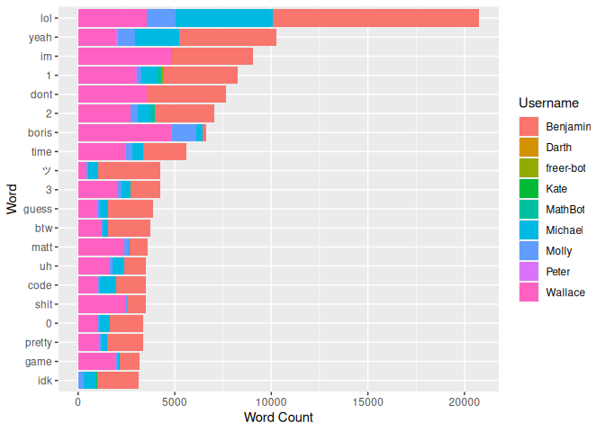
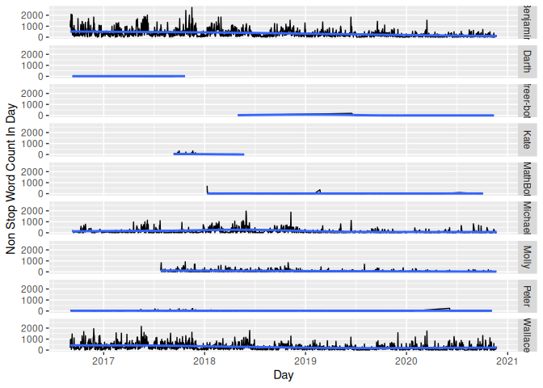
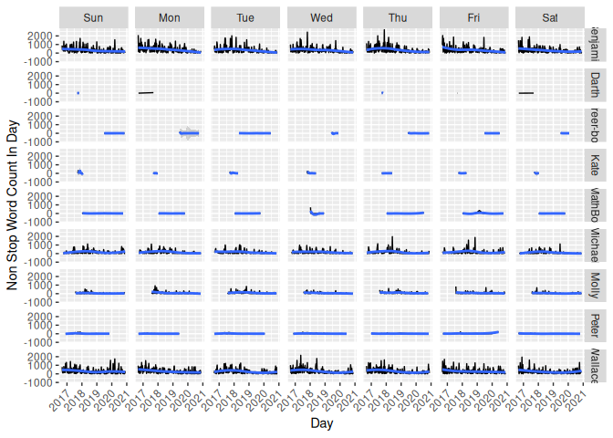
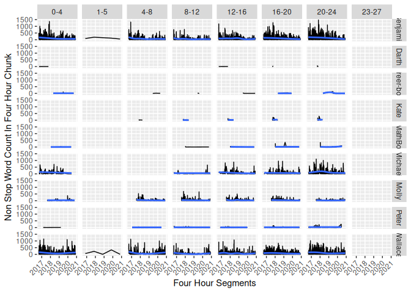

# Text Analysis of a Discord Chat Group

## Thanks to the Editor

A large thank you to [William Zhu](https://github.com/ZhuWilliam) for
editing this poorly written document into something nice.

## Data Acquisition

To get the data needed for analysis, there are two methods. First is the
discord api’s [Get Channel
Message](https://discordapp.com/developers/docs/resources/channel#get-channel-messages)
to manually retrieve the messages. The second, is to get a discord bot
to do it for you. However, if you do not wish to setup a bot, you can
use the first method to do bare api calls in python.

Big thanks to
[DiscordArchiver](https://github.com/Jiiks/DiscordArchiver/blob/master/DiscordArchiver/Program.cs#L15)
for the undocumented (and probably old api that may be discontinued on
October 16, 2017) url parameter for the token.

After creating `discord_chat_dl.py` and running it with the token, the
channel id, and the id of the last message, you can download all of the
chat logs in a json format.

## Data Import

``` r
library(jsonlite)

chat_json <- read_json('discord_chat_anonymized.json')
```

This imports the json chat log as an R list. However, the list is not
uniform in fields across message entries as some messages have
reactions, a feature introduced later in Discord’s development that
messages before the update do not have. This inconsistency prevents
running the list into `data.table::rbindlist`, so I used an alternative
method. I extracted the relevant fields with
[purrr](https://cran.r-project.org/web/packages/purrr/vignettes/other-langs.html)
and then stitched it back together into a
[data.table](https://cran.r-project.org/web/packages/data.table/vignettes/datatable-intro.html).
I then checked the result with
[dplyr’s](https://cran.r-project.org/web/packages/dplyr/vignettes/dplyr.html)
glimpse. Note that time was converted to PST/PDT. All times shown will
be with repsect to PST/PDT.

``` r
library(purrr)
library(data.table) # masks some of lubridate's functions
library(lubridate)
library(dplyr)
library(dtplyr)

chat <- data.table(
    timestamp = map_chr(chat_json, 'timestamp') %>% ymd_hms(),
    username = map_chr(chat_json, c('author', 'username')) %>% as.factor(),
    message = map_chr(chat_json, 'content')
    )

chat[, timestamp := with_tz(timestamp, tzone = 'US/Pacific')] # convert to PST (same time)

glimpse(chat)
```

    ## Rows: 245,977
    ## Columns: 3
    ## $ timestamp <dttm> 2017-09-12 01:03:34, 2017-09-12 01:03:17, 2017-09-12 01:03…
    ## $ username  <fct> Benjamin, Benjamin, Benjamin, Benjamin, Wallace, Benjamin, …
    ## $ message   <chr> "although the rate limits are probably the most *rate* limi…

``` r
chat[1, timestamp]
```

    ## [1] "2017-09-12 01:03:34 PDT"

## Data Tidying

### User and Message Tidying

Some users did not post much so we filter them out. On top of filtering
users, we remove URLs and long digits with regex.

``` r
library(magrittr) # for %<>% (originator of %>%)
library(stringr)

chat %<>%
    .[!.[, .N, username][N < 100], on = 'username'] %>% # anti join
    .[, username := droplevels(username)] %>%
    .[, message := str_replace(message, '(https?\\S+)|(\\d{4,})', '')]
```

### Word Tokenization

To convert the `chat` data.table into a more convienient [tidy
format](http://tidytextmining.com/tidytext.html), with one token per
row, we can use
[tidytext](https://cran.r-project.org/web/packages/tidytext/vignettes/tidytext.html).
Common words can cause problems, but they can be removed with the help
of tidytext’s `stop_words`.

``` r
library(tidytext)

words <- chat %>%
    unnest_tokens(word, message) %>%
    .[!data.table(stop_words), on = 'word'] # anti join

glimpse(words)
```

    ## Rows: 371,075
    ## Columns: 3
    ## $ timestamp <dttm> 2017-09-12 01:03:34, 2017-09-12 01:03:34, 2017-09-12 01:03…
    ## $ username  <fct> Benjamin, Benjamin, Benjamin, Benjamin, Benjamin, Benjamin,…
    ## $ word      <chr> "rate", "limits", "rate", "limiting", "goodbye", "performan…

### Bigram Tokenization

Next, we prepare the tokenization of bigrams in much the same fashion as
for words by using `unnest_tokens`, followed by
[tidyr’s](https://cran.r-project.org/web/packages/tidyr/vignettes/tidy-data.html)
separate, and finally removing common words.

``` r
library(tidyr)

bigrams <- chat %>%
    unnest_tokens(bigram, message, token = 'ngrams', n = 2) %>%
    data.table() %>% # unnest tokens on words returns the same structure but on bigrams it returns a tibble
    separate(bigram, c('word1', 'word2'), sep = ' ') %>%
    .[!word1 %in% stop_words$word & !word2 %in% stop_words$word,]

glimpse(bigrams)
```

    ## Rows: 196,469
    ## Columns: 4
    ## $ timestamp <dttm> 2016-09-02 20:22:36, 2016-09-02 20:22:38, 2016-09-02 20:28…
    ## $ username  <fct> Benjamin, Benjamin, Wallace, Benjamin, Benjamin, Benjamin, …
    ## $ word1     <chr> NA, NA, NA, NA, "wont", "reacive", "instant", NA, NA, NA, N…
    ## $ word2     <chr> NA, NA, NA, NA, "reacive", "instant", "messages", NA, NA, N…

## Data Analysis

### Word Counts

What are the top words? Here we check the top three words per user.

``` r
word_counts <- words %>%
    .[, .N, .(username, word)] %>%
    setorder(-N)

word_counts[, head(.SD, 3), username]
```

    ##     username   word    N
    ##  1: Benjamin    lol 4148
    ##  2: Benjamin   yeah 1418
    ##  3: Benjamin      1 1391
    ##  4:  Wallace     im 2005
    ##  5:  Wallace   dont 1515
    ##  6:  Wallace    lol 1346
    ##  7:  Michael    lol 1192
    ##  8:  Michael   yeah  514
    ##  9:  Michael     uh  221
    ## 10:    Molly    lol  278
    ## 11:    Molly   yeah   78
    ## 12:    Molly people   31
    ## 13:    Peter   yeah   37
    ## 14:    Peter people   17
    ## 15:    Peter   guys   17

How about visually?

``` r
library(ggplot2)

#word_counts %>%
    #.[head(setorder(.[, .(total = sum(N)), word], -total), 20), on = 'word'] %>%
    #ggplot(aes(reorder(word, total), N, fill = username)) +
    #geom_col() +
    #coord_flip()

word_counts %>%
    .[.[, .(total = sum(N)), word] %>%
        setorder(-total) %>%
        head(20)
    , on = 'word'] %>%
    ggplot(aes(reorder(word, total), N, fill = username)) +
    geom_col() +
    coord_flip() +
    labs(x = 'Word', y = 'Word Count', fill = 'Username')
```

<!-- -->

``` r
#words_by_day <- words %>%
    #.[, .(timestamp = floor_date(timestamp, 'day'))] %>%
    #.[, .(words_in_day = .N), timestamp] %>%
    #.[, .(timestamp, words_in_day, day_of_week = wday(timestamp, label = TRUE))]

words_by_day <- words %>%
    #.[, `:=`(username = NULL, word = NULL)] %T>% glimpse() %>%
    .[, .(timestamp = floor_date(timestamp, 'day'))] %>%
    .[, .(words_in_day = .N), timestamp] %>%
    .[, day_of_week := wday(timestamp, label = TRUE)]

plot <- ggplot(words_by_day, aes(timestamp, words_in_day)) +
    geom_line() +
    geom_smooth() +
    labs(x = 'Day', y = 'Non Stop Word Count in Day')

plot
```

<!-- -->

``` r
theme_x_axis_text_45 <- theme(axis.text.x = element_text(angle = 45, vjust = 1.1,  hjust = 1.1))

plot +
    facet_grid(.~day_of_week) +
    theme_x_axis_text_45
```

<!-- -->

``` r
    #theme(axis.text.x = element_text(angle = 90, vjust = 0.5,  hjust = 1))
```

``` r
words_by_day_per_user <- copy(words) %>%
    .[, `:=`(word = NULL, timestamp = floor_date(timestamp, 'day'))] %>%
    .[, .(words_in_day_per_user = .N), .(timestamp, username)] %>%
    .[, day_of_week := wday(timestamp, label = TRUE)]

plot <- ggplot(words_by_day_per_user, aes(timestamp, words_in_day_per_user)) +
    geom_line() +
    geom_smooth() +
    labs(x = 'Day', y = 'Non Stop Word Count In Day')

plot +
    facet_grid(username~.)
```

<!-- -->

``` r
plot +
    facet_grid(username ~ day_of_week) +
    theme_x_axis_text_45
```

<!-- -->

``` r
    #theme(axis.text.x = element_text(angle = 45, vjust = 1.1,  hjust = 1.1))
```

``` r
#TODO: check timezone and consider making the 4 in 4 hours per chunk a variable
chat[1, timestamp]
```

    ## [1] "2017-09-12 01:03:34 PDT"

``` r
words_by_hour <- words %>%
    #.[, `:=`(username = NULL, word = NULL)] %T>% glimpse() %>%
    .[, .(timestamp = floor_date(timestamp, '4 hours'))] %>%
    .[, .(words_in_hour = .N), timestamp] %>%
    .[, hours_chunk := hour(timestamp)]

glimpse(words_by_hour)
```

    ## Rows: 1,631
    ## Columns: 3
    ## $ timestamp     <dttm> 2017-09-12 00:00:00, 2017-09-11 20:00:00, 2017-09-11 1…
    ## $ words_in_hour <int> 103, 387, 279, 30, 28, 18, 42, 103, 62, 13, 47, 34, 404…
    ## $ hours_chunk   <int> 0, 20, 16, 12, 4, 0, 20, 16, 12, 4, 0, 16, 12, 8, 4, 0,…

``` r
words_by_hour[, head(.SD, 3), hours_chunk]
```

    ##     hours_chunk           timestamp words_in_hour
    ##  1:           0 2017-09-12 00:00:00           103
    ##  2:           0 2017-09-11 00:00:00            18
    ##  3:           0 2017-09-10 00:00:00            47
    ##  4:          20 2017-09-11 20:00:00           387
    ##  5:          20 2017-09-10 20:00:00            42
    ##  6:          20 2017-09-08 20:00:00            32
    ##  7:          16 2017-09-11 16:00:00           279
    ##  8:          16 2017-09-10 16:00:00           103
    ##  9:          16 2017-09-09 16:00:00            34
    ## 10:          12 2017-09-11 12:00:00            30
    ## 11:          12 2017-09-10 12:00:00            62
    ## 12:          12 2017-09-09 12:00:00           404
    ## 13:           4 2017-09-11 04:00:00            28
    ## 14:           4 2017-09-10 04:00:00            13
    ## 15:           4 2017-09-09 04:00:00            38
    ## 16:           8 2017-09-09 08:00:00           405
    ## 17:           8 2017-09-07 08:00:00           300
    ## 18:           8 2017-09-06 08:00:00            41
    ## 19:           1 2016-11-06 01:00:00           148

``` r
words_by_hour[, .(.N), hours_chunk]
```

    ##    hours_chunk   N
    ## 1:           0 298
    ## 2:          20 334
    ## 3:          16 319
    ## 4:          12 268
    ## 5:           4 207
    ## 6:           8 204
    ## 7:           1   1

``` r
copy(words)[, time := floor_date(timestamp, '4 hours')] %>%
    .[, hours_chunk := hour(time)] %>%
    .[hours_chunk == 1] %T>%
    .[, timestamp]
```

    ##                timestamp username      word                time hours_chunk
    ##   1: 2016-11-06 03:56:55 Benjamin        ic 2016-11-06 01:00:00           1
    ##   2: 2016-11-06 03:56:43 Benjamin       wtf 2016-11-06 01:00:00           1
    ##   3: 2016-11-06 03:56:41 Benjamin     magic 2016-11-06 01:00:00           1
    ##   4: 2016-11-06 03:56:41 Benjamin      mode 2016-11-06 01:00:00           1
    ##   5: 2016-11-06 03:56:39 Benjamin       esc 2016-11-06 01:00:00           1
    ##  ---                                                                       
    ## 144: 2016-11-06 01:36:45 Benjamin customers 2016-11-06 01:00:00           1
    ## 145: 2016-11-06 01:36:45 Benjamin returning 2016-11-06 01:00:00           1
    ## 146: 2016-11-06 01:36:45 Benjamin remaining 2016-11-06 01:00:00           1
    ## 147: 2016-11-06 01:36:45 Benjamin  software 2016-11-06 01:00:00           1
    ## 148: 2016-11-06 01:36:45 Benjamin    update 2016-11-06 01:00:00           1

``` r
unique(tz(chat[, timestamp]))
```

    ## [1] "US/Pacific"

``` r
hour_chunk_labeller <- function(hours_in_chunk)
{
    function(facet_var)
    {
        paste(facet_var, as.numeric(facet_var) + hours_in_chunk, sep = '-')
    }
}

ggplot(words_by_hour, aes(timestamp, words_in_hour)) +
    geom_line() +
    geom_smooth() +
    facet_grid(.~hours_chunk, labeller = as_labeller(hour_chunk_labeller(4))) +
    labs(x = 'Four Hour Segments', y = 'Non Stop Word Count In Four Hour Chunk') +
    theme_x_axis_text_45
```

<!-- -->

``` r
words_by_hour_per_user <- copy(words) %>%
    .[, `:=`(word = NULL, timestamp = floor_date(timestamp, '4 hours'))] %>%
    .[, .(words_in_hour_per_user = .N), .(timestamp, username)] %>%
    .[, hours_chunk := hour(timestamp)]

glimpse(words_by_hour_per_user)
```

    ## Rows: 3,152
    ## Columns: 4
    ## $ timestamp              <dttm> 2017-09-12 00:00:00, 2017-09-12 00:00:00, 201…
    ## $ username               <fct> Benjamin, Wallace, Benjamin, Wallace, Michael,…
    ## $ words_in_hour_per_user <int> 97, 6, 113, 259, 15, 176, 79, 19, 2, 3, 12, 9,…
    ## $ hours_chunk            <int> 0, 0, 20, 20, 20, 16, 16, 16, 16, 16, 12, 12, …

``` r
ggplot(words_by_hour_per_user, aes(timestamp, words_in_hour_per_user)) +
    geom_line() +
    geom_smooth() +
    facet_grid(username ~ hours_chunk,
               labeller = labeller(hours_chunk = as_labeller(hour_chunk_labeller(4)))) +
    labs(x = 'Four Hour Segments', y = 'Non Stop Word Count In Four Hour Chunk') +
    theme_x_axis_text_45
```

<!-- -->

### Bigram Counts

``` r
bigram_counts <- bigrams %>%
    .[, .N, .(username, word1, word2)] %>%
    setorder(-N)

bigram_counts[, head(.SD, 3), username]
```

    ##     username  word1  word2     N
    ##  1: Benjamin   <NA>   <NA> 56320
    ##  2: Benjamin    1st     qu    96
    ##  3: Benjamin    3rd     qu    96
    ##  4:  Wallace   <NA>   <NA> 28086
    ##  5:  Wallace   holy   shit   331
    ##  6:  Wallace     im  gonna   131
    ##  7:  Michael   <NA>   <NA>  5275
    ##  8:  Michael   page  table    37
    ##  9:  Michael      0      0    19
    ## 10:    Molly   <NA>   <NA>   961
    ## 11:    Molly dragon    age     6
    ## 12:    Molly   dark  souls     4
    ## 13:    Peter   <NA>   <NA>   185
    ## 14:    Peter     11     10     3
    ## 15:    Peter    red weapon     3
